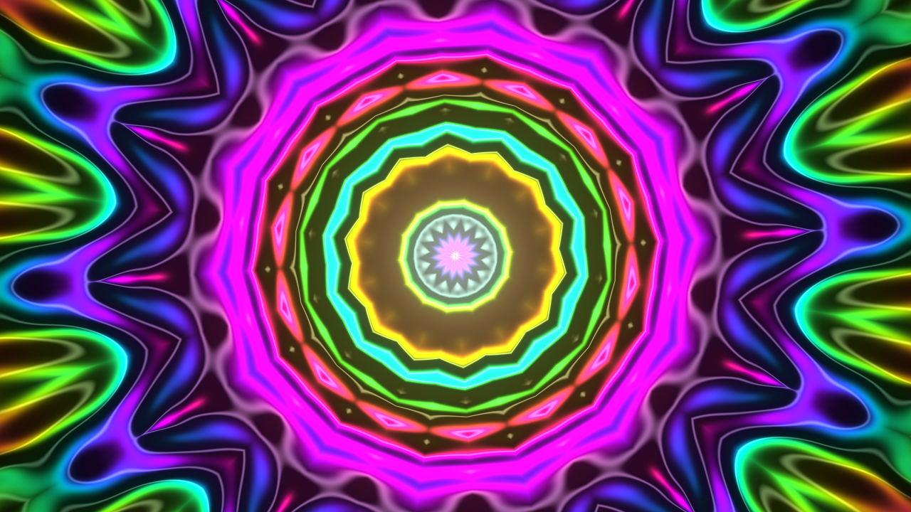
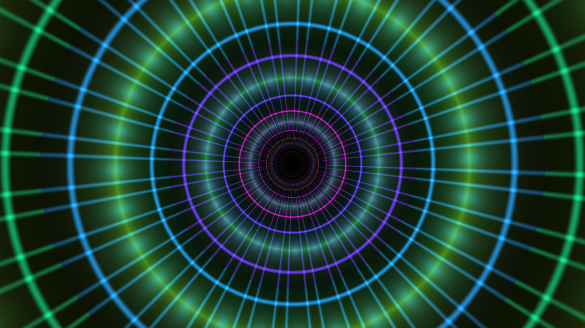
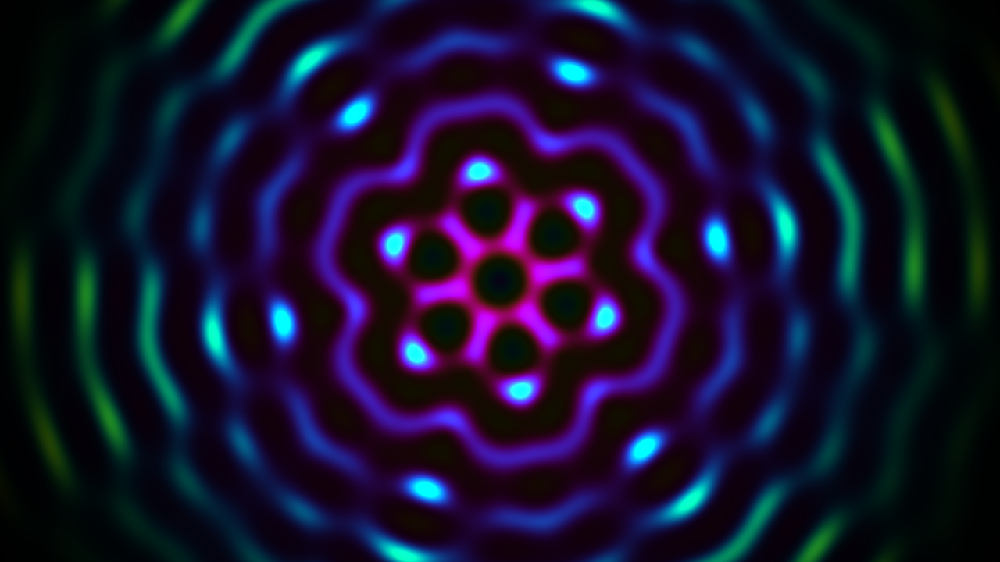
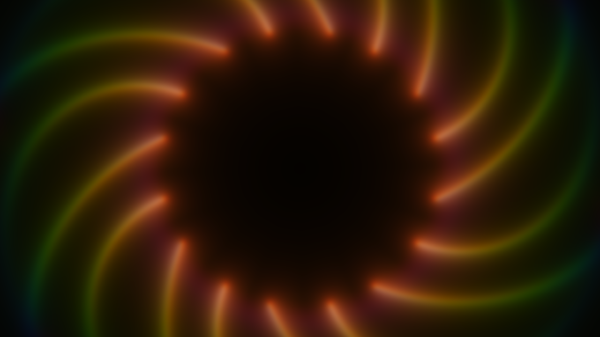

# mandala · vgpu

A GPU mandala instrument built on [vgpu](https://vgpu.sh) — Vercel's agent-first WebGPU
library. Four modes, all pure WGSL fragment work, played live with the mouse. When you
stop moving, an autopilot takes the cursor on a slow lissajous orbit and the mandala
plays itself.

| | |
|---|---|
|  |  |
| **Bloom** — breathing kaleidoscope | **Depths** — infinite yantra tunnel |
|  |  |
| **Temple** — flower-of-life moiré | **Echo** — feedback light-painting |

## Modes

- **Bloom** — layered sine interference folded into n mirrored petals.
  `mouse.x` sets the petal count, `mouse.y` shifts the hue.
- **Depths** — log-polar space scrolling toward the viewer; a lattice of rings,
  spokes and nodes glows along the tunnel walls. `mouse.x` wedge count, `mouse.y` fall speed.
- **Temple** — two counter-rotating hexagonal rings of wave sources; their sum makes
  breathing moiré mandalas. `mouse.x` carrier frequency, `mouse.y` detune.
- **Echo** — a ping-pong `rgba16float` accumulation target. Each frame samples the
  previous one through a slow rotate + zoom, decays it, and injects light at the cursor
  folded through 8-way symmetry. Trails become mandalas; you play it like an instrument.

## Controls

`move` steer · `1–4` switch modes · `f` fullscreen · idle 4s and the autopilot takes over.

## Run

```bash
npm install
npm run dev
```

Requires a WebGPU browser (Chrome, Edge, Safari 18+).

## vgpu things this leans on

- `.wgsl` files import each other like TypeScript modules — the shared math lives in
  [`src/shaders/lib/mandala.wgsl`](src/shaders/lib/mandala.wgsl) and is resolved at build
  time by `@vgpu/wgsl/loader-vite`.
- `pingPong(gpu, ...)` for the Echo feedback pair, `frame.pass()` batching both passes
  into one submit.
- Headless validation: every image above was rendered by
  [`scripts/snapshot.mjs`](scripts/snapshot.mjs) via `vgpu/node` (Dawn on Metal) — no
  browser, no eyes, just pixels read back and judged.

```bash
npm run check:wgsl        # device-backed WGSL validation of all five shaders
node scripts/snapshot.mjs # re-render the images in assets/
```
