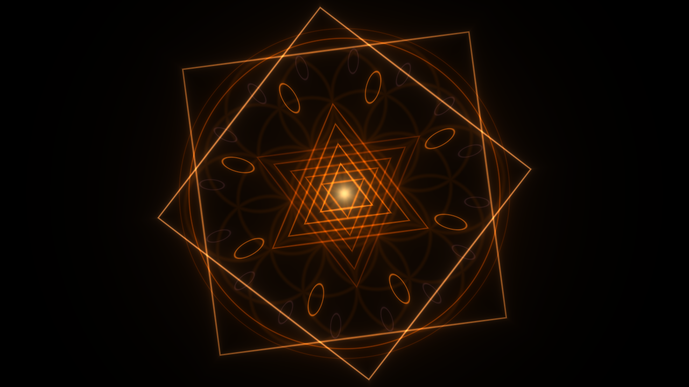
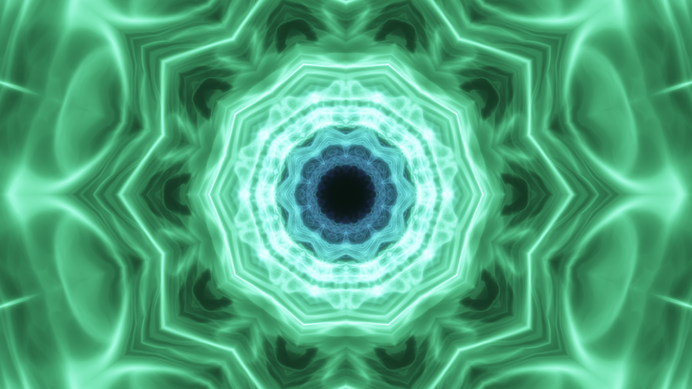
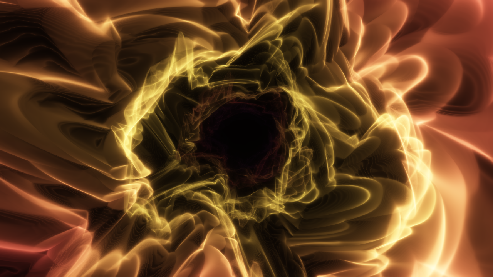
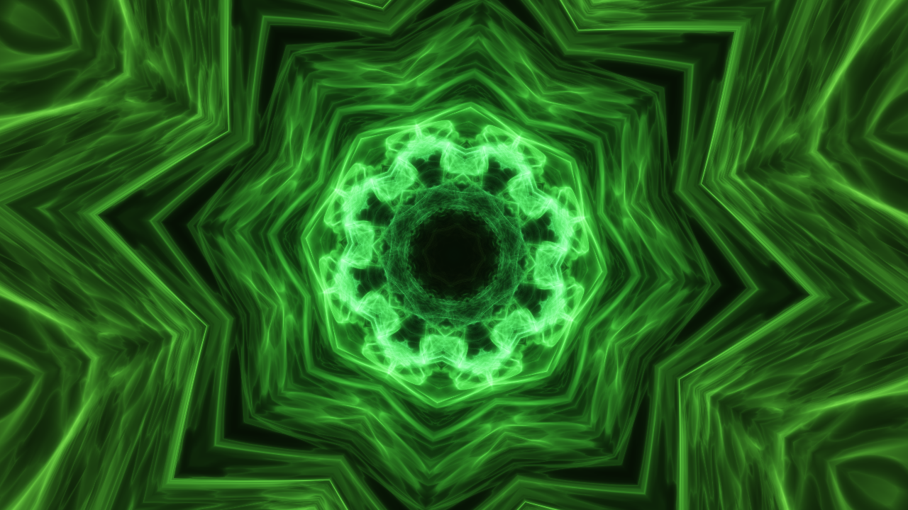
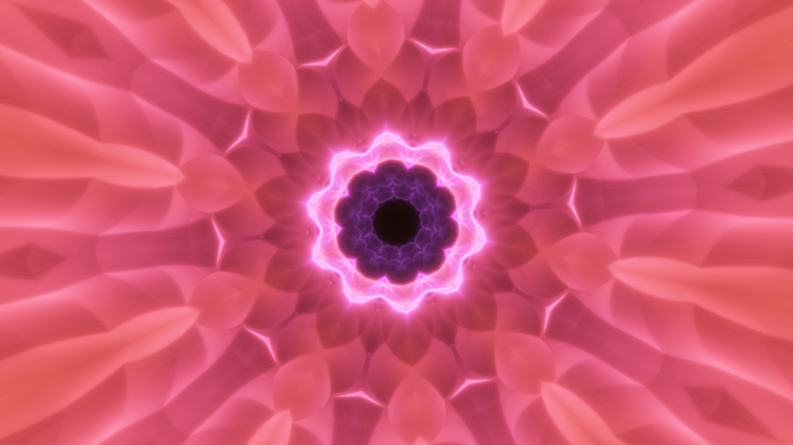

# mandala · vgpu

A GPU mandala instrument built on [vgpu](https://vgpu.sh) — Vercel's agent-first WebGPU
library. Six hand-tuned modes plus **the Codex**, a seeded generator that births
brand-new volumetric mandala shaders at runtime. Played live with the mouse; go idle
and an autopilot cursor takes the mandala on a slow lissajous orbit. Fullscreen (`f`)
removes every trace of text.

| | |
|---|---|
|  |  |
| **Bloom** — breathing kaleidoscope | **Depths** — infinite yantra tunnel |
|  |  |
| **Temple** — flower-of-life moiré | **Echo** — feedback light-painting |
|  |  |
| **Yantra** — Sri Yantra homage | **Vortex** — volumetric fog mandala |

## The Codex

Press `g` and a new shader is born: a complete WGSL raymarcher assembled from a seed,
in the tweet-shader idiom (cosine turbulence folds, exponential glow accumulation,
`tanh` tonemap) with its structure drawn from sacred geometry — fold symmetries from
the sacred counts (3, 5, 6, 7, 8, 9, 12), drift rates touched by φ, three archetypes:
**smoke** (turbulent tube nebulae), **lattice** (repeating glowing cells), **shell**
(fluted petal columns). Every birth gets a generated name and a shareable URL
(`#codex-<seed>`).

| | |
|---|---|
|  |  |
| seed 90210 — smoke, free rotation | seed 7 — smoke, 6-fold |
|  |  |
| seed 4 — shell, 8-fold | seed 1 — lattice, 5-fold |

## Sacred geometry library

[`src/shaders/lib/sacred.wgsl`](src/shaders/lib/sacred.wgsl) is a pure WGSL module of
the classic constructions, importable from any entry shader: vesica piscis, the
19-circle Seed/Fruit of Life lattice, Metatron's cube (13 nodes, all 78 pairs joined),
regular polygons and triangle glyphs, lotus petal rings, golden-angle phyllotaxis, the
golden log-spiral. The Yantra mode composes them the way the tradition does: bindu →
nine interlocking triangles (four Shiva up, five Shakti down) → lotus rings of 8 and
16 → three circles → bhupura gates.

## Controls

`move` steer · `1–7` modes · `space` next · `c` auto-cycle · `g` new codex birth ·
`f` fullscreen (hides all text) · idle 4s and the autopilot takes over.

## Run

```bash
npm install
npm run dev
```

Requires a WebGPU browser (Chrome, Edge, Safari 18+).

## vgpu things this leans on

- `.wgsl` files import each other like TypeScript modules — shared math in
  [`lib/mandala.wgsl`](src/shaders/lib/mandala.wgsl) and
  [`lib/sacred.wgsl`](src/shaders/lib/sacred.wgsl), resolved at build time by
  `@vgpu/wgsl/loader-vite`.
- `effect(gpu, wgsl)` takes plain strings, which is what lets the Codex compile
  shaders that did not exist a frame earlier.
- `pingPong(gpu, ...)` for the Echo feedback pair, `frame.pass()` batching both passes
  into one submit.
- Headless validation: every image above was rendered by
  [`scripts/snapshot.mjs`](scripts/snapshot.mjs) via `vgpu/node` (Dawn on Metal) — no
  browser, just pixels read back and judged, with exposure bugs caught and fixed from
  the readbacks alone.

```bash
npm run check:wgsl        # device-backed WGSL validation of all entry shaders
node scripts/snapshot.mjs # re-render the images in assets/
```
